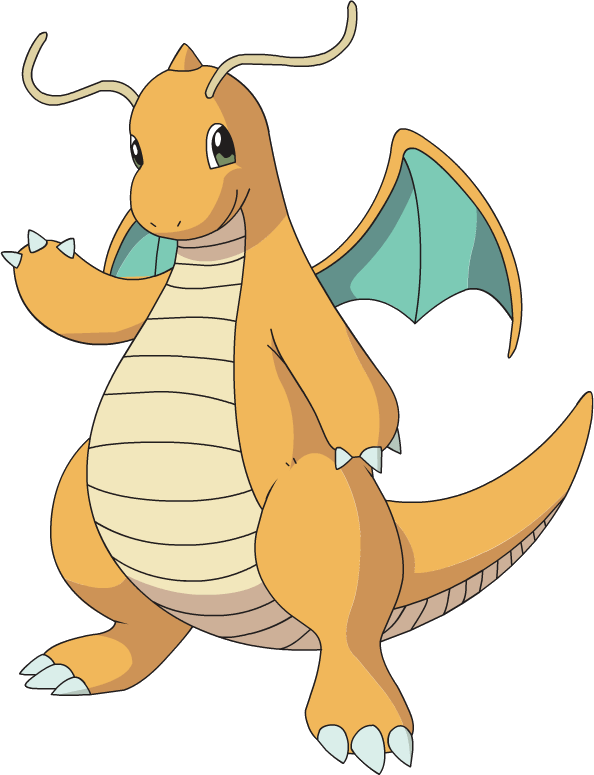

```{r setup, include=FALSE}
knitr::opts_chunk$set(echo = TRUE)
library(readr)
library(tidyverse)
library(knitr)
library(kableExtra)
library(fmsb)

pkm <- readr::read_csv("https://raw.githubusercontent.com/cienciadedatos/datos-de-miercoles/master/datos/2019/2019-07-10/pokemon.csv")

```


<br>
<hr style="border:1px solid gray"/>

<div style="text-align: justify">
En esta web encontrarás un breve análisis sobre datos de Pokémon, esas criaturas con las cuales hemos pasado parte de nuestra infancia/ adolescencia (y parte de nuestra vida adulta también `r emojifont::emoji("smiley_cat")`). Previo a sumergirnos en los datos, haremos una breve introducción al mundo Pokémon contándote un poco sobre estas facinantes criaturas.
<br>
<hr style="border:1px solid gray"/>

## ¿Qué es Pokémon?#
Es una franquicia que inició originalmente como un videojuego de RPG (Role Playing Game) y que luego se expandió a diversos medios como serie televisiva, juego de cartas, ropa, entre otros. La palabra **Pokémon** deriva de una contracción de _**poket monsters**_ (monstruos de bolsillo).
Los Pokémon son criaturas inspiradas en animales, objetos, plantas o criaturas mitológicas. Los jugadores de este videojuego son conocidos como entrenadores Pokémon y sus objetivos son recopilar todas las especies de Pokémon, "atraparlos" y entrenarlos para poder competir con otros entrenadores y determinar quién posee los Pokémon más fuertes.
</div>

<hr style="border:1px solid gray"/>

<div style="text-align: justify">
## ¡Un poco de nostalgia!
Por si no tenés idea de lo que es Pokémon te dejamos el _openning_ (presentacion inicial) de la primer entrega de la serie televisiva, emitida en el año 1997. Esta temporada se desarrolla en la región Kanto, hogar de alrededor de 150 tipos de Pokémon, y del protagonista Ash Ketchum, quien junto a su compañero Pikachu, sale a retar Gimnasios Pokémon y a ganar un lugar en el Torneo de la Liga Índigo.
</div>

<div style="text-align:center;">
<iframe  width="770" height="350" src="https://www.youtube.com/embed/uDIoEbbFKAY" title="YouTube video player" frameborder="0" allow="accelerometer; autoplay; clipboard-write; encrypted-media; gyroscope; picture-in-picture" allowfullscreen></iframe>
</div>


<hr style="border:1px solid gray"/>

<div style="text-align: justify">
## Dataset de Pokémon
El conjunto de datos que analizaremos contiene información sobre las características de los diversos Pokémon existentes. Este análisis será realizado sobre la _**primer generación**_ de Pokémon, que incluye 150 criaturas distintas.
Los datos fueron extraídos de [Datos de miercoles](https://github.com/cienciadedatos/datos-de-miercoles/tree/master/datos/2019/2019-07-10){target="_blank"}.
Dentro de las características más importantes de los Pokémon podemos mencionar el _tipo de pokémon_ y los diferentes puntos de _habilidades_ como ataque, defensa, velocidad, puntos de vida, entre otros.

### Tipos de Pokémon
A continuación en el gráfico \@ref(fig:graf1) se muestran los distintos tipos existentes en la primer generación Pokémon. Cabe destacar que un Pokémon puede tener hasta dos tipos. En este primer análisis nos centraremos solo en el primer tipo, sin importar si los Pokémon tienen más de un tipo:

<div>
```{r graf1, echo= FALSE,fig.cap ="Cantidad de Pokémon por tipo",  fig.align= "center"}

#creamos un vector con los colores referidos a los tipos de pkm
pkm_color <- c("Normal"="#A8A77A","Fuego"="#EE8130","Agua"="#6390F0","Eléctrico"="#F7D02C",
"Césped"="#7AC74C","Hielo"="#96D9D6","Luchador"="#C22E28","Veneno"="#A33EA1",
"Tierra"="#E2BF65","Volador"="#A98FF3","Psíquico"="#F95587","Bicho"="#A6B91A",
"Roca"="#B6A136","Fantasma"="#735797","Dragón"="#6F35FC","Oscuro"="#705746","Acero"="#B7B7CE","Hada"="#D685AD")

pkm %>% 
  filter(generacion == 1) %>%
  ggplot()+
  geom_bar(aes((forcats::fct_infreq(tipo_1)),fill= tipo_1))+
  coord_flip()+
  scale_fill_manual(values = pkm_color) +
  labs(x= "Tipo de Pokémon", y = "Cantidad", 
       title = "Cantidad de Pokémon por tipo",
       subtitle = "Pokémon primera generación")+
  geom_text(stat='count', aes(x = tipo_1, label = ..count..), hjust = -0.5)+
  theme_classic()+
  theme(legend.position="none")
  
```
</div>

Como se puede observar existe una mayor cantidad de Pokémons del tipo agua, por lo que será mas probable que nos encontremos con un Pokémon de este tipo que por ejemplo con uno de tipo Hielo o Hada.


### Cuál es el tipo de Pokémon con mejores estadísticas?
A continuación buscaremos, dentro de la primer generación, cuáles son los Pokémon que tienen mejores puntos totales. Esta característica surge de la sumatoria de los puntos de ataque, defensa, salud, velocidad, ataque especial y defensa especial. Los tipos de Pokémon que tienen mejor puntaje total promedio son:


```{r tabl1, tab.cap="Tipo de Pokémon con mejores estadísticas", results='asis',fig.align= "center" ,message= FALSE, echo= FALSE }
#kable lo lleva a formato tabla
kbl(pkm %>% 
  group_by(tipo_1) %>% 
  summarise(Total= round(mean(total),1), Ataque= round(mean(ataque),1), Defensa= round(mean(defensa),1),
            Salud= round(mean(puntos_vida),1), Velocidad= round(mean(velocidad),1),
            Ataque_especial= round(mean(fuerza_especial_ataque),1), Defensa_especial= round(mean(fuerza_especial_defensa),1)) %>% 
  arrange(desc(Total)) %>% 
  top_n(5,Total), caption ="Tipo de Pokémon con mejores estadísticas") %>%
   kable_styling(bootstrap_options = "responsive", full_width = F, position = "center")
```

La tabla \@ref(tab:tabl1)  nos proporciona un primer acercamiento a este _**top 5**_ de Pokémon _**más fuertes**_. Para una rápida observación hemos ordenado los datos en forma descendente, de modo tal que los tipos que mejor estadísticas tengan aparezan primeros.
Con los datos obtenidos realizaremos una visualizacion gráfica en _boxplots_ (gráfico \@ref(fig:graf3)) para comparar los puntos totales entre los diferentes tipos de Pokémon observados en la tabla anterior:


```{r graf3, fig.cap ="Top 5 de Pokémon con mayores stats totales promedio", message= FALSE, echo= FALSE, results='asis', fig.align= "center" }
pkm %>%
  filter(tipo_1 == "Dragón"|tipo_1 == "Acero"|tipo_1 =="Volador"|tipo_1 =="Psíquico"|tipo_1 =="Fuego") %>% 
  ggplot(aes(x= reorder(tipo_1, total, na.rm = TRUE),y= total, fill= tipo_1))+
  geom_boxplot()+
  scale_fill_manual(values = pkm_color)+
  theme(legend.position="none")+
  labs(x= "Tipo de Pokémon", y = "Puntos totales", 
       title = "Top 5 de Pokémon con mayores stats totales promedio",
       subtitle = "Pokémon primera generación")
  
```
<br>

Del análisis del gráfico \@ref(fig:graf3) de cajas  podemos observar que que los Pókemon tipo _dragon_ son los "más fuertes". Sin embargo, un hecho destacable es que los Pokémon del tipo psíquico tienen ejemplares casi tan fuertes como los dragones, pero a la vez también contienen a los mas débiles de este ranking. Al mirar la gráfica correspondiente al tipo volador, observamos que no hay _bigotes_ como en las otras cajas y existe un valor _outlier_.

Una consideración importante que debemos realizar a esta altura, es que si bien los Pokémon del tipo dragón son los que mejores puntos promedio tienen, en el gráfico \@ref(fig:graf1) solo se observan 3 Pokémon de dicho tipo. Esto nos permite suponer que los dragones no son un tipo de Pokémon que encontraremos habitualmente, y que si bien _son los más fuertes_, quizás nos convenga capturar alguno de tipo fuego o psíquico en vez de esperar cruzarnos al ansiado dragón.

Ahora si, volvamos a nuestros valores más altos. Dentro del tipo dragón, el Pokémon que tiene puntos característicos más altos es _**Dragonite**_, que pertenece a la primer generación de Pokémon y está identificado con el número 149. Dragonite se destaca por ser un Pokémon bondadoso y compasivo al que le resulta imposible dar la espalda a otros Pokémon o humanos que se encuentren a la deriva. A continuacióm en el gráfico \@ref(fig:graf4) podremos observar un Dragonite y sus stats:

<div style="text-align:center">
<table style="text-align:center">
  <tr>
    <td>
      
    </td>
    <td>
    
```{r graf4, fig.cap ="Dragonite", message= FALSE, echo= FALSE, results='asis', fig.align= "center", fig.height = 7, fig.width = 7}
pkm_c <- pkm %>% 
  filter(nombre_traducido == "Dragonite") %>% 
  select(puntos_vida, ataque, defensa, velocidad, ataque_especial= fuerza_especial_ataque, defensa_especial= fuerza_especial_defensa)

pkm_d <- rbind(rep(150,6),rep(0,6),pkm_c)

radarchart(pkm_d, pcol=rgb(0.2,0.5,0.5,0.9), pfcol=rgb(0.2,0.5,0.5,0.5), plwd=4,
           vlcex=1, cglcol="grey", cglty=1, cglwd=1)
```
    </td>
  </tr>
</table>
</div>
### Distribución de los stats de los tipos de Pokémon más fuertes
A continuación en el  gráfico \@ref(fig:graf5) se muestra el Top 5 de tipos de Pokémon más fuertes ordenados por su ataque, defensa y puntos de vida. Del gráfico podemos observar que los Pokémon del tipo Acero son los que más defensa tienen en general, y podemos ver que los psíquicos son los que mejores valores de ataque poseen. A su vez, se visualiza que hay muy pocos Pokémon voladores, y que los de tipo fuego son los más abundantes:

```{r graf5, fig.cap ="Distribución de los stats de los Top 5 de tipos de Pokémon más fuertes", message= FALSE, echo= FALSE, results='asis', fig.align= "center" }
pkm %>%
   filter(tipo_1 == "Dragón"|tipo_1 == "Acero"|tipo_1 =="Volador"|tipo_1 =="Psíquico"|tipo_1 =="Fuego") %>% 
  ggplot(aes(defensa,ataque)) +
  geom_point(aes( color=tipo_1,size= puntos_vida ), alpha=0.5) +
  scale_color_manual(values = pkm_color) +
  scale_size(name   = "Puntos de vida")  + 
  facet_wrap(~tipo_1, ncol=5) +
  labs(x= "Defensa",
       y = "Ataque", 
       color="Tipos de Pokémon",
     title = "Distribución de los stats de los Top 5 de tipos de Pokémon más fuertes ",
     subtitle = "Pokémon: Todas las generaciones") +
  theme(legend.position = "bottom",
        legend.box = "vertical")
```
</div>
<br>

<hr style="border:1px solid gray"/>

<div style="text-align: justify">
Y hasta aquí llegamos con este análisis sobre la primera generación de Pokémon. Esperamos que hayan aprendido un poco sobre estas criaturas y disfrutado de nuestro trabajo, el cual forma parte de la materia _**Visualización de datos**_ de la [Diplomatura en Análisis de datos aplicados al desarrollo de políticas públicas](https://www.unab.edu.ar/diplomatura-analisis-datos.html#:~:text=Diplomatura%20en%20an%C3%A1lisis%20de%20datos%20aplicados%20al%20desarrollo%20de%20pol%C3%ADticas%20p%C3%BAblicas&text=El%20programa%20de%20la%20Diplomatura,manejar%20grandes%20vol%C3%BAmenes%20de%20datos){target="_blank"} dictada por la [Universidad Nacional Guillermo Brown](https://www.unab.edu.ar/index.html){target="_blank"}. Las personas que han sido las encargadas de brindarnos todo su conocimiento y apoyo en las clases fueron [Yanina Bellini](https://github.com/yabellini){target="_blank"} y [Paola Corrales](https://github.com/paocorrales){target="_blank"}.
</div>

<div style="text-align: center">
Esten atentos y atentas, y prepárense para más información, visualizaciones y estadísticas sobre sus Pokémon favoritos.
</div>

<hr style="border:1px solid gray"/>

<div style="text-align: center">
**Patricia, G. - Nicolás, F.**
</div>
